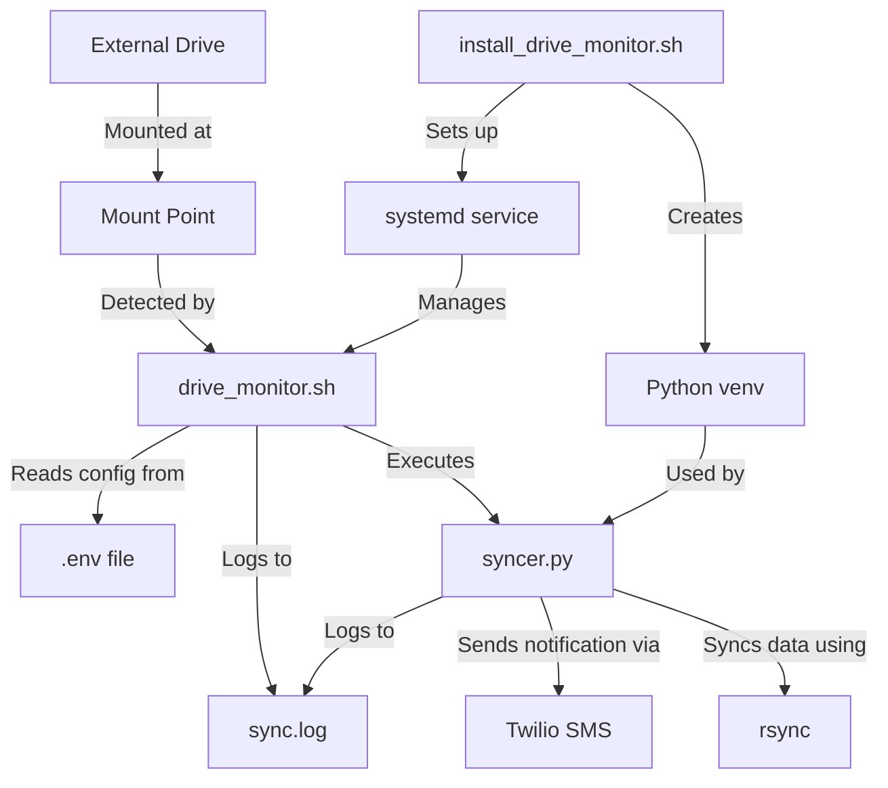

   # External Drive Sync System

This system automatically detects when an external drive is mounted at the configured mount point and runs a sync operation using rsync. It logs all activities to a single log file.

## Architecture



## Components

- **drive_monitor.sh**: Bash script that monitors `/proc/mounts` for the external drive
- **syncer.py**: Python script that performs the sync operation using rsync
- **drive-monitor.service**: Systemd user service configuration
- **install_drive_monitor.sh**: Installation script that sets up the service and Python environment
- **.env**: Configuration file containing environment variables
- **sync.log**: Single log file for all system events

## How It Works

1. The system runs as a systemd user service in the background
2. It continuously monitors `/proc/mounts` for the presence of the external drive
3. When the drive is detected, it runs the syncer.py script to:
   - Sync data from the source directory to the destination directory using rsync
   - Log all operations to sync.log
   - Send an SMS notification with the sync results
4. The system waits for the drive to be unmounted before resuming monitoring

## Configuration

The system is configured through the `.env` file, which contains:

```
TWILIO_ACCOUNT_SID="your_twilio_sid"
TWILIO_AUTH_TOKEN="your_twilio_token"
SOURCE_DIR="/path/to/source/directory"
DEST_DIR="/path/to/destination/directory"
MOUNT_POINT="/media/user/drive"
TO_PHONE_NUMBER="+1234567890"
MGS="your_twilio_messaging_service_sid"
```

## Installation

1. Make the installation script executable:
   ```bash
   chmod +x syncer/install_drive_monitor.sh
   ```

2. Run the installation script:
   ```bash
   ./syncer/install_drive_monitor.sh
   ```

3. The script will:
   - Set up a Python virtual environment (if it doesn't exist)
   - Install required Python packages
   - Make all scripts executable
   - Create the initial log file
   - Install the systemd service for your user
   - Enable and start the service

## Usage

The service runs automatically in the background. When you connect your external drive at the configured mount point, the system will:

1. Detect the mount
2. Run the sync operation using rsync
3. Log all activities to sync.log
4. Send an SMS notification with the sync results

## Checking Status

- Check service status:
  ```bash
  systemctl --user status drive-monitor.service
  ```

- View logs:
  ```bash
  cat syncer/sync.log
  ```

## Stopping or Disabling

- Stop the service:
  ```bash
  systemctl --user stop drive-monitor.service
  ```

- Disable the service (won't start on boot):
  ```bash
  systemctl --user disable drive-monitor.service
  ```

## Troubleshooting

If the system isn't working as expected:

1. Check the service status:
   ```bash
   systemctl --user status drive-monitor.service
   ```

4. Review the logs:
   ```bash
   cat syncer/sync.log
   ```

5. Ensure the mount point is correct:
   ```bash
   grep "your_mount_point" /proc/mounts
   ```

6. Verify the Python executable exists:
   ```bash
   ls -la syncer/.venv/bin/python
   ```

## Advanced Usage

### Manual Sync

You can manually run the sync operation by executing:

```bash
syncer/.venv/bin/python syncer/syncer.py
```

### Updating Configuration

If you update the `.env` file, you need to restart the service for changes to take effect:

```bash
systemctl --user restart drive-monitor.service
```

### Reinstalling the Service

If you make changes to the scripts or service configuration, you can reinstall the service:

```bash
./syncer/install_drive_monitor.sh
```

The installation script is designed to preserve your existing Python virtual environment while updating the service configuration.