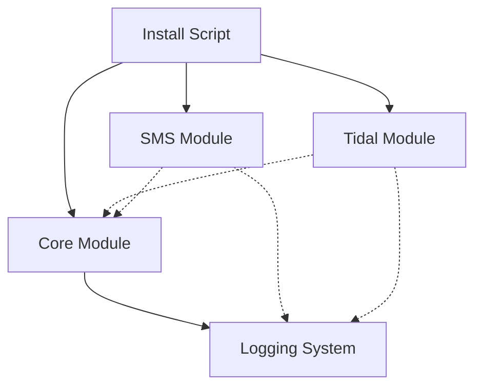
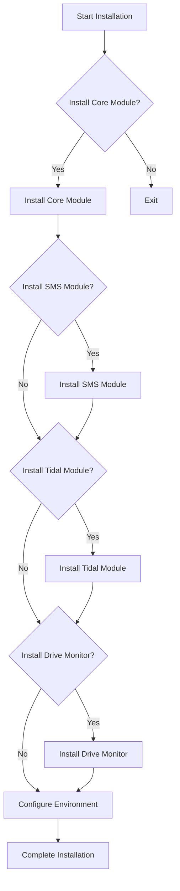

# Syncer Implementation Plan

## Overview

This implementation plan outlines the architecture for a modular file synchronization system with optional Tidal music download integration and SMS notification capabilities. The system will consist of several components that can be installed independently based on user preferences.

## System Components



### Core Components

1. **Core Module (syncer.py)**
   - Handles file synchronization using rsync
   - Provides both CLI and programmatic interfaces
   - Can run independently or be called by other modules

2. **Logging System**
   - Centralized logging to a single file
   - Timestamps on each log entry
   - Used by all modules

### Optional Components

3. **SMS Module (send_sms.py)**
   - Handles SMS notifications
   - Can be installed or omitted based on user preference

4. **Tidal Module (tidal.py)**
   - Handles downloading music from Tidal
   - Can trigger the syncer after successful downloads
   - Can be installed or omitted based on user preference

5. **Drive Monitor (drive_monitor.sh)**
   - Monitors for drive connections
   - Triggers syncer when drives are connected
   - Optional component

## File Structure

```
/syncer/
├── install.sh              # Main installation script
├── requirements.txt        # Python dependencies
├── syncer.py               # Core synchronization module
├── send_sms.py             # Optional SMS notification module
├── tidal.py                # Optional Tidal download module
├── drive_monitor.sh        # Optional drive monitoring script
├── drive-monitor.service   # Systemd service file for drive monitoring
├── install_drive_monitor.sh # Script to install drive monitor service
├── .env.example            # Example environment configuration
└── sync.log                # Centralized log file
```

## Module Specifications

### 1. Core Module (syncer.py)

**Purpose**: Synchronize files between directories using rsync.

**Features**:
- Environment variable configuration
- Initial sync and resync modes
- Programmatic API for being called by other scripts
- Detailed logging with timestamps
- Optional SMS notifications (if SMS module is installed)

**Functions**:
- `log_message()`: Log messages with timestamps
- `sync_directories()`: Perform the actual rsync operation
- `run_sync()`: Programmatic interface for other modules
- `main()`: CLI entry point

**Dependencies**:
- Python standard library
- dotenv (for environment variables)
- send_sms module (optional)

### 2. SMS Module (send_sms.py)

**Purpose**: Send SMS notifications about sync and download events.

**Features**:
- Configurable via environment variables
- Simple API for sending messages
- Error handling and logging

**Functions**:
- `send_sms()`: Send an SMS message

**Dependencies**:
- Python standard library
- Twilio or similar SMS service API

### 3. Tidal Module (tidal.py)

**Purpose**: Download music from Tidal and trigger syncs after successful downloads.

**Features**:
- Download tracks from Tidal URLs
- Parse download results
- Trigger syncer after successful downloads
- SMS notifications (if SMS module is installed)

**Functions**:
- `log_message()`: Log messages with timestamps
- `parse_tidal_output()`: Extract download statistics
- `main()`: CLI entry point

**Dependencies**:
- Python standard library
- tidal-dl-ng command-line tool
- syncer module
- send_sms module (optional)

### 4. Drive Monitor (drive_monitor.sh)

**Purpose**: Monitor for drive connections and trigger syncs.

**Features**:
- Detect when drives are connected
- Trigger initial sync on connection
- Trigger resyncs periodically
- Run as a systemd service

**Dependencies**:
- Bash
- syncer module

## Installation Process

The installation script will provide a modular installation process with the following options:



### Installation Script (install.sh)

The installation script will:

1. Check system requirements
2. Create necessary directories
3. Prompt for installation options:
   - Core module (required)
   - SMS module (optional)
   - Tidal module (optional)
   - Drive monitor (optional)
4. Install selected components
5. Configure environment variables
6. Set up logging
7. Install Python dependencies based on selected components

## Configuration

### Environment Variables (.env)

The system will use a `.env` file for configuration with the following variables:

```
# Core Configuration
SOURCE_DIR=/path/to/source
DEST_DIR=/path/to/destination
MOUNT_POINT=/path/to/mount
LOG_FILE=/path/to/sync.log

# SMS Configuration (Optional)
SMS_ENABLED=true
TO_PHONE_NUMBER=+1234567890
MGS=your_message_service_id

# Tidal Configuration (Optional)
TIDAL_ENABLED=true
TIDAL_QUALITY=LOSSLESS
```

## Logging System

All modules will use a centralized logging system with:

1. Single log file in the same directory as the scripts
2. Timestamps on each log entry
3. Consistent format across all modules
4. Rotation to prevent excessive file size

## Implementation Details

### 1. Core Module Implementation

```python
#!/usr/bin/env python3

import os
import subprocess
import datetime
import sys
import argparse
from dotenv import load_dotenv

# Conditionally import SMS module if available
try:
    from send_sms import send_sms
    SMS_AVAILABLE = True
except ImportError:
    SMS_AVAILABLE = False

# Load environment variables
load_dotenv()

# Configuration variables
SOURCE_DIR = os.getenv("SOURCE_DIR")
DEST_DIR = os.getenv("DEST_DIR")
MOUNT_POINT = os.getenv("MOUNT_POINT")
LOG_FILE = os.getenv("LOG_FILE", "sync.log")  # Default to local directory

def log_message(message):
    """Log a message with a timestamp to the log file."""
    timestamp = datetime.datetime.now().strftime('%Y-%m-%d %H:%M:%S')
    log_entry = f"{timestamp} - {message}"
    print(log_entry)
    with open(LOG_FILE, "a") as log_file:
        log_file.write(log_entry + "\n")

def sync_directories(is_initial_sync=True):
    """Sync directories using rsync."""
    # Implementation details...
    
    # Conditionally use SMS if available
    if SMS_AVAILABLE and is_initial_sync:
        send_sms(message=sms_msg, to=os.environ.get("TO_PHONE_NUMBER"), mgs=os.environ.get("MGS"))

def run_sync(is_initial_sync=True, custom_message=None):
    """Programmatic interface for other modules."""
    # Implementation details...
    return success_status

def main():
    """CLI entry point."""
    # Parse arguments and run sync
    # Implementation details...

if __name__ == "__main__":
    main()
```

### 2. SMS Module Implementation

```python
#!/usr/bin/env python3

import os
import sys
import datetime
from twilio.rest import Client
from dotenv import load_dotenv

# Load environment variables
load_dotenv()

# Get log file path from environment or use default
LOG_FILE = os.getenv("LOG_FILE", "sync.log")

def log_message(message):
    """Log a message with a timestamp to the log file."""
    timestamp = datetime.datetime.now().strftime('%Y-%m-%d %H:%M:%S')
    log_entry = f"{timestamp} - SMS - {message}"
    with open(LOG_FILE, "a") as log_file:
        log_file.write(log_entry + "\n")

def send_sms(message, to, mgs):
    """Send an SMS message using Twilio."""
    try:
        # Implementation details...
        log_message(f"SMS sent to {to}: {message}")
        return True
    except Exception as e:
        log_message(f"Error sending SMS: {str(e)}")
        return False
```

### 3. Tidal Module Implementation

```python
#!/usr/bin/env python3

import os
import sys
import subprocess
import datetime
import re
from dotenv import load_dotenv

# Conditionally import modules
try:
    import syncer
    SYNCER_AVAILABLE = True
except ImportError:
    SYNCER_AVAILABLE = False

try:
    from send_sms import send_sms
    SMS_AVAILABLE = True
except ImportError:
    SMS_AVAILABLE = False

# Load environment variables
load_dotenv()

# Get log file path from environment or use default
LOG_FILE = os.getenv("LOG_FILE", "sync.log")

def log_message(message):
    """Log a message with a timestamp to the log file."""
    timestamp = datetime.datetime.now().strftime('%Y-%m-%d %H:%M:%S')
    log_entry = f"{timestamp} - TIDAL - {message}"
    print(log_entry)
    with open(LOG_FILE, "a") as log_file:
        log_file.write(log_entry + "\n")

def parse_tidal_output(output):
    """Parse the tidal-dl-ng output to extract relevant information."""
    # Implementation details...
    return summary

def main():
    """Main function to execute the script."""
    # Implementation details...
    
    # Conditionally use SMS if available
    if SMS_AVAILABLE:
        send_sms(message=sms_message, to=os.environ.get("TO_PHONE_NUMBER"), mgs=os.environ.get("MGS"))
    
    # Conditionally use syncer if available and files were downloaded
    if SYNCER_AVAILABLE and summary['tracks_downloaded'] > 0:
        syncer.run_sync(is_initial_sync=False, custom_message=f"Sync triggered by Tidal")

if __name__ == "__main__":
    main()
```

### 4. Installation Script Implementation

```bash
#!/bin/bash

# Colors for output
GREEN='\033[0;32m'
YELLOW='\033[1;33m'
RED='\033[0;31m'
NC='\033[0m' # No Color

# Function to print colored messages
print_message() {
    echo -e "${GREEN}[INFO]${NC} $1"
}

print_warning() {
    echo -e "${YELLOW}[WARNING]${NC} $1"
}

print_error() {
    echo -e "${RED}[ERROR]${NC} $1"
}

# Check if Python 3 is installed
if ! command -v python3 &> /dev/null; then
    print_error "Python 3 is required but not installed. Please install Python 3 and try again."
    exit 1
fi

# Create .env file
create_env_file() {
    print_message "Creating .env file..."
    
    read -p "Enter source directory path: " SOURCE_DIR
    read -p "Enter destination directory path: " DEST_DIR
    read -p "Enter mount point path: " MOUNT_POINT
    
    # Set default log file in the current directory
    LOG_FILE="$(pwd)/sync.log"
    
    echo "# Core Configuration" > .env
    echo "SOURCE_DIR=$SOURCE_DIR" >> .env
    echo "DEST_DIR=$DEST_DIR" >> .env
    echo "MOUNT_POINT=$MOUNT_POINT" >> .env
    echo "LOG_FILE=$LOG_FILE" >> .env
    
    # Add SMS configuration if selected
    if [ "$INSTALL_SMS" = "y" ]; then
        echo "" >> .env
        echo "# SMS Configuration" >> .env
        read -p "Enter your phone number: " PHONE_NUMBER
        read -p "Enter your message service ID: " MGS
        echo "TO_PHONE_NUMBER=$PHONE_NUMBER" >> .env
        echo "MGS=$MGS" >> .env
    fi
    
    print_message ".env file created successfully."
}

# Install core module
install_core() {
    print_message "Installing core module..."
    pip3 install python-dotenv
    touch sync.log
    chmod +x syncer.py
    print_message "Core module installed successfully."
}

# Install SMS module
install_sms() {
    print_message "Installing SMS module..."
    pip3 install twilio
    chmod +x send_sms.py
    print_message "SMS module installed successfully."
}

# Install Tidal module
install_tidal() {
    print_message "Installing Tidal module..."
    pip3 install tidal-dl-ng
    chmod +x tidal.py
    print_message "Tidal module installed successfully."
}

# Install drive monitor
install_drive_monitor() {
    print_message "Installing drive monitor..."
    chmod +x drive_monitor.sh
    chmod +x install_drive_monitor.sh
    ./install_drive_monitor.sh
    print_message "Drive monitor installed successfully."
}

# Main installation process
print_message "Starting installation..."

# Prompt for component selection
read -p "Install core module? (y/n, default: y): " INSTALL_CORE
INSTALL_CORE=${INSTALL_CORE:-y}

if [ "$INSTALL_CORE" = "y" ]; then
    read -p "Install SMS module? (y/n, default: n): " INSTALL_SMS
    INSTALL_SMS=${INSTALL_SMS:-n}
    
    read -p "Install Tidal module? (y/n, default: n): " INSTALL_TIDAL
    INSTALL_TIDAL=${INSTALL_TIDAL:-n}
    
    read -p "Install drive monitor? (y/n, default: n): " INSTALL_DRIVE_MONITOR
    INSTALL_DRIVE_MONITOR=${INSTALL_DRIVE_MONITOR:-n}
    
    # Create requirements.txt based on selections
    echo "python-dotenv" > requirements.txt
    
    if [ "$INSTALL_SMS" = "y" ]; then
        echo "twilio" >> requirements.txt
    fi
    
    if [ "$INSTALL_TIDAL" = "y" ]; then
        echo "tidal-dl-ng" >> requirements.txt
    fi
    
    # Install Python dependencies
    pip3 install -r requirements.txt
    
    # Install selected components
    install_core
    
    if [ "$INSTALL_SMS" = "y" ]; then
        install_sms
    fi
    
    if [ "$INSTALL_TIDAL" = "y" ]; then
        install_tidal
    fi
    
    if [ "$INSTALL_DRIVE_MONITOR" = "y" ]; then
        install_drive_monitor
    fi
    
    # Create .env file
    create_env_file
    
    print_message "Installation completed successfully!"
else
    print_message "Installation cancelled."
fi
```

## Testing Strategy

1. **Unit Testing**:
   - Test each module independently
   - Verify logging functionality
   - Test conditional imports

2. **Integration Testing**:
   - Test syncer with and without SMS
   - Test Tidal with and without syncer
   - Test drive monitor with syncer

3. **Installation Testing**:
   - Test installation with different component combinations
   - Verify environment configuration

## Deployment

1. Clone the repository
2. Run the installation script
3. Select desired components
4. Configure environment variables
5. Start services as needed

## Maintenance and Updates

- Keep a changelog for version tracking
- Document any changes to the API or configuration
- Provide upgrade scripts for future versions

## Future Enhancements and Extensions

### 1. Web Interface
- Develop a web dashboard for monitoring sync status
- Provide visual statistics and logs
- Allow remote triggering of sync operations
- User authentication for secure access

### 2. Advanced Notification System
- Expand beyond SMS to include:
  - Email notifications
  - Push notifications
  - Integration with messaging platforms (Slack, Discord, etc.)
- Customizable notification templates
- Notification preferences (frequency, triggers, etc.)

### 3. Enhanced Tidal Integration
- Support for additional music services (Spotify, Apple Music, etc.)
- Playlist management and synchronization
- Metadata enrichment and organization
- Custom download filters and rules

### 4. Automated Testing and CI/CD
- Unit and integration test suite
- Automated deployment pipeline
- Version management
- Dependency tracking and updates

### 5. Multi-device Synchronization
- Support for multiple source/destination pairs
- Conflict resolution strategies
- Bidirectional synchronization
- Differential backup options

### 6. Performance Optimizations
- Parallel processing for large file sets
- Incremental scanning for changed files
- Compression options for network transfers
- Bandwidth throttling and scheduling

### 7. Security Enhancements
- Encryption for sensitive data
- Secure authentication for remote operations
- Audit logging for security events
- Permission management for shared installations

### 8. Extensible Plugin System
- Allow third-party plugins for additional functionality
- Standardized API for extensions
- Package management for plugins
- Configuration interface for plugin settings